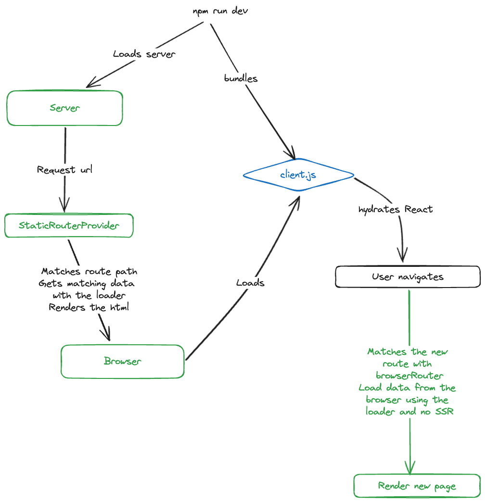

# ssr-bun

Example for a server-side rendered app using [bun](https://bun.sh/), [react](https://react.dev/) and [react-router](https://reactrouter.com/)

- Supports navigation and requests from the client once the page is loaded.
- Uses loaders to fetch data on the server and client
- Has statics assets support using `/public`
- Streams the servers responses with `renderToReadableStream`
- Has error page for network errors
- Has 404 page for not found routes



To install dependencies:

```bash
bun install

```

To run:

```bash
bun run dev
```

Open http://localhost:5000 in your browser.
